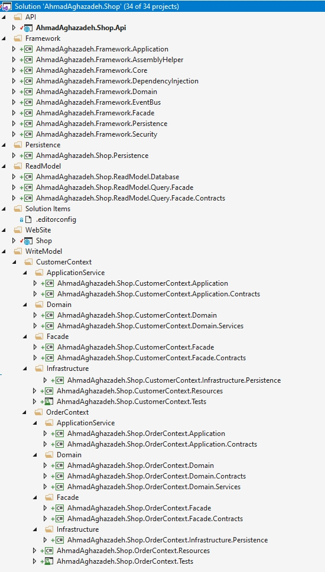
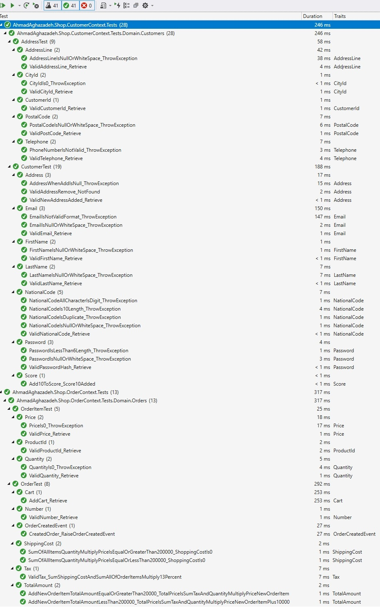

# Domain-Driven Design With Test-driven development

> A curated list of Domain-Driven Design (DDD), Command Query Responsibility Segregation (CQRS), Event Sourcing, Swagger, Test-driven development

**[Domain-Driven Design (DDD)](https://en.m.wikipedia.org/wiki/Domain-driven_design)** is an approach to software development for complex needs by connecting the implementation to an evolving model. The premise of Domain-Driven Design is the following:

- placing the project's primary focus on the core domain and domain logic
- basing complex designs on a model of the domain
- initiating a creative collaboration between technical and domain experts to iteratively refine a conceptual model that addresses particular domain problems

The term was coined by Eric Evans in his book of the same title.

**[Command Query Responsibility Segregation (CQRS)](http://codebetter.com/gregyoung/2010/02/16/cqrs-task-based-uis-event-sourcing-agh/)** is simply the creation of two objects where there was previously only one. The separation occurs based upon whether the methods are a command or a query (the same definition that is used by Meyer in Command and Query Separation, a command is any method that mutates state and a query is any method that returns a value).

**[Event Sourcing](http://www.martinfowler.com/eaaDev/EventSourcing.html)** the fundamental idea of Event Sourcing is that of ensuring every change to the state of an application is captured in an event object, and that these event objects are themselves stored in the sequence they were applied for the same lifetime as the application state itself.

**[Swagger](https://swagger.io/)**
Simplify API development for users, teams, and enterprises with the Swagger open source and professional toolset. Find out how Swagger can help you design and document your APIs at scale.

**[Test-driven development](https://en.wikipedia.org/wiki/Test-driven_development)**
Test-driven development (TDD) is a software development process that relies on the repetition of a very short development cycle: requirements are turned into very specific test cases, then the code is improved so that the tests pass. This is opposed to software development that allows code to be added that is not proven to meet requirements.

### Solution Structure

### Unit Test List

